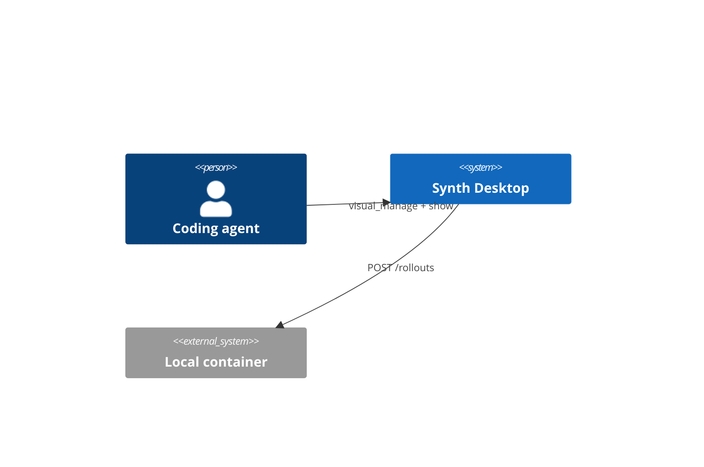

# C4

Use for system context. C4 is a Mermaid family on `diagram.mermaid.v1`, not a second renderer.

```mermaid
C4Context
  Person(agent, "Coding agent")
  System(desktop, "Synth Desktop")
  System_Ext(container, "Local container")
  Rel(agent, desktop, "visual_manage + show")
  Rel(desktop, container, "POST /rollouts")
```
