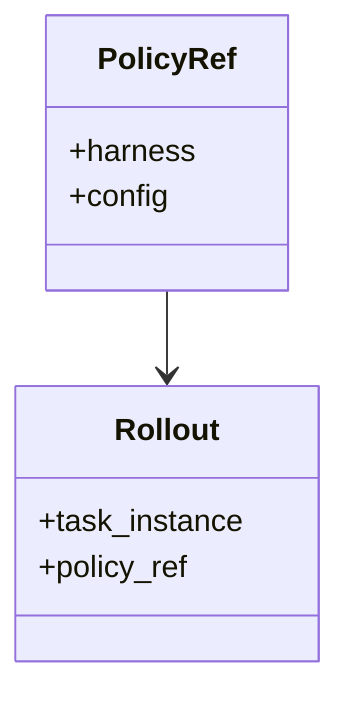

# Class

Use for nouns and fields (`policy_ref`, rollout, visual).

```mermaid
classDiagram
  class PolicyRef {
    +harness
    +config
  }
  class Rollout {
    +task_instance
    +policy_ref
  }
  PolicyRef --> Rollout
```
