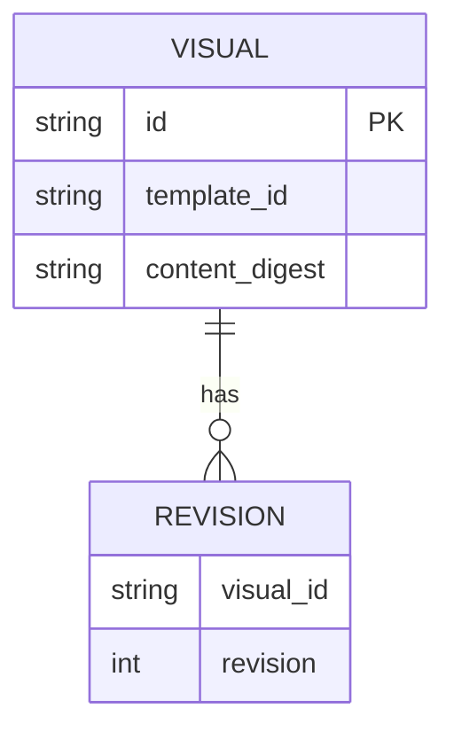

# ER

Use for records and relations, not runtime call order.

```mermaid
erDiagram
  VISUAL ||--o{ REVISION : has
  VISUAL {
    string id PK
    string template_id
    string content_digest
  }
  REVISION {
    string visual_id
    int revision
  }
```
