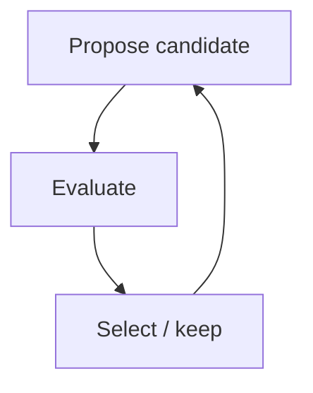

# Feedback loop

Use flowchart or state for GEPA-style propose → evaluate → select. Author the actual loop for this question; do not ship this file as the visual.

```mermaid
flowchart TD
  Propose[Propose candidate] --> Evaluate[Evaluate]
  Evaluate --> Select[Select / keep]
  Select --> Propose
```
