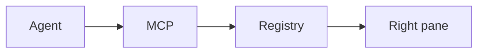

# Flowchart

Use for topology: agent → MCP → registry, or a pipeline of stages.

```mermaid
flowchart LR
  Agent[Agent] --> MCP[MCP]
  MCP --> Registry[Registry]
  Registry --> Pane[Right pane]
```

Direction: `LR` or `TD`. Nodes: `id[label]`, `id(rounded)`, `id{decision}`. Edges: `-->`.
