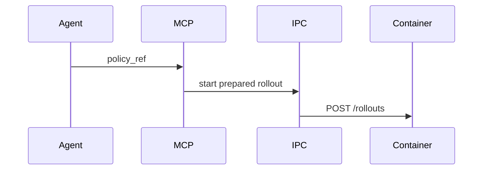

# Sequence

Use for ordered calls: who talks to whom, in what order.

```mermaid
sequenceDiagram
  participant Agent
  participant MCP
  participant IPC
  participant Container
  Agent->>MCP: policy_ref
  MCP->>IPC: start prepared rollout
  IPC->>Container: POST /rollouts
```
