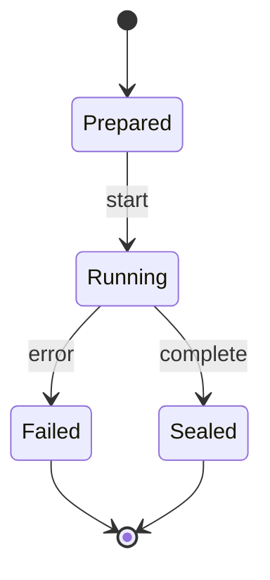

# State

Use for lifecycles: prepared → running → sealed, or render queued → ready | failed.

```mermaid
stateDiagram-v2
  [*] --> Prepared
  Prepared --> Running: start
  Running --> Sealed: complete
  Running --> Failed: error
  Failed --> [*]
  Sealed --> [*]
```
