# Banking77 visual suite — aesthetic review

**Date:** 2026-09-02  
**Workshop instance:** `liveann` (`v0.9.5`)  
**Scope:** right-panel presentation for eval, SFT, GEPA, and CISPO

## Evidence reviewed

| Surface | Visual ID | Revision | Evidence mode | Captures |
|---|---|---:|---|---|
| Eval review | `vis_164d19f2dd474b248d3cdf50bef2321a` | 2 | Real completed Banking77 eval | Aggregate, rollout summary, rubric/verifier |
| SFT training | `vis_99bddeb7f3f94947af5b18e890d3a293` | 3 | Bundled Banking77 preview | Overview, evaluation summaries, provenance |
| GEPA search | `vis_9ca20b4c89ae4ebda81f87b79a4c2a77` | 3 | Bundled Banking77 preview | Overview, candidate exploration, Pareto/frontier |
| CISPO training | `vis_6066c13d4b234eaab02eec4995514df2` | 3 | Bundled preview | Overview, identity, training/evaluation sections |

The screenshots were captured from the running Workshop app during this QA pass. The three optimizer visuals are previews because this instance has no persisted SFT, GEPA, or CISPO run to bind. They must not be read as evidence of a completed production run or real uplift.

## Screenshot catalogue

### Suite in Workshop

The `Banking77` registry filter keeps the four review surfaces together in the left rail while the selected visual remains open in the right-hand preview.

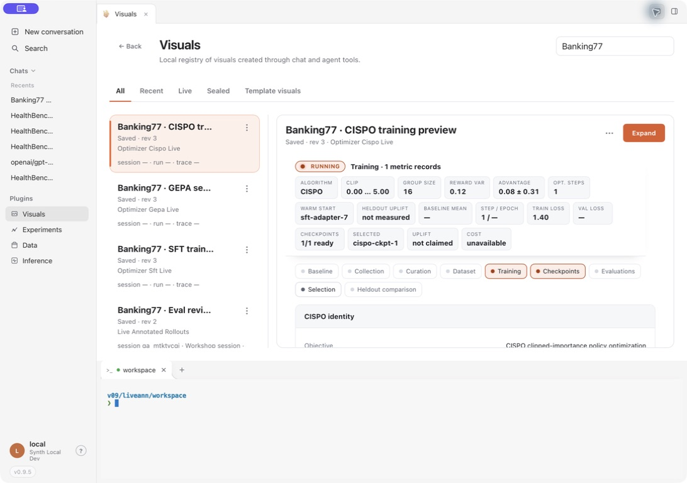

### Eval review

The aggregate leads with the outcome and compact rollout lanes.

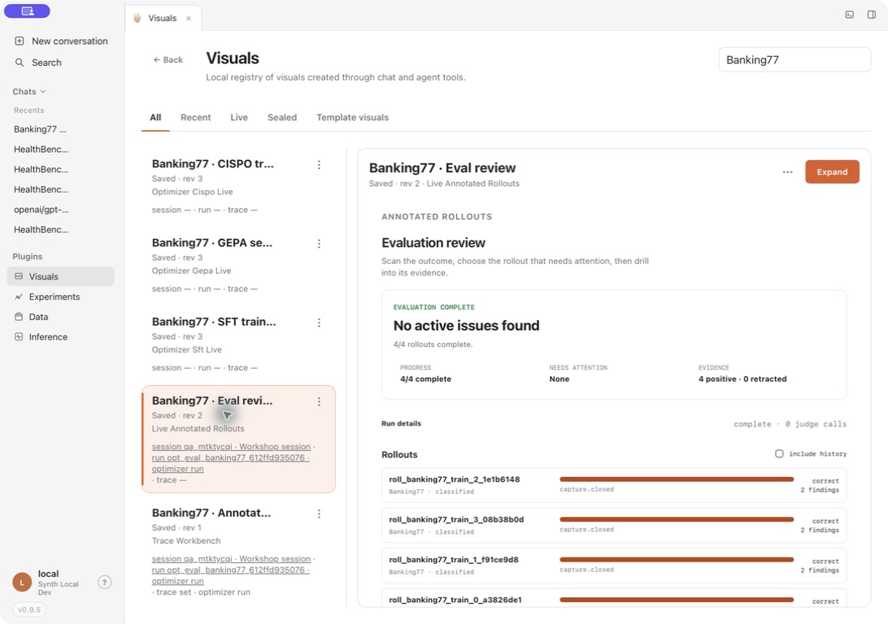

Selecting a lane reveals its task summary and evidence navigation.

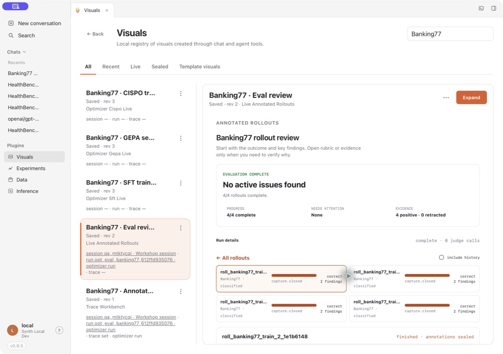

The rubric view demonstrates the misleading `Rubric · 2` badge: the panel contains verifier fallback information but no structured rubric rows.

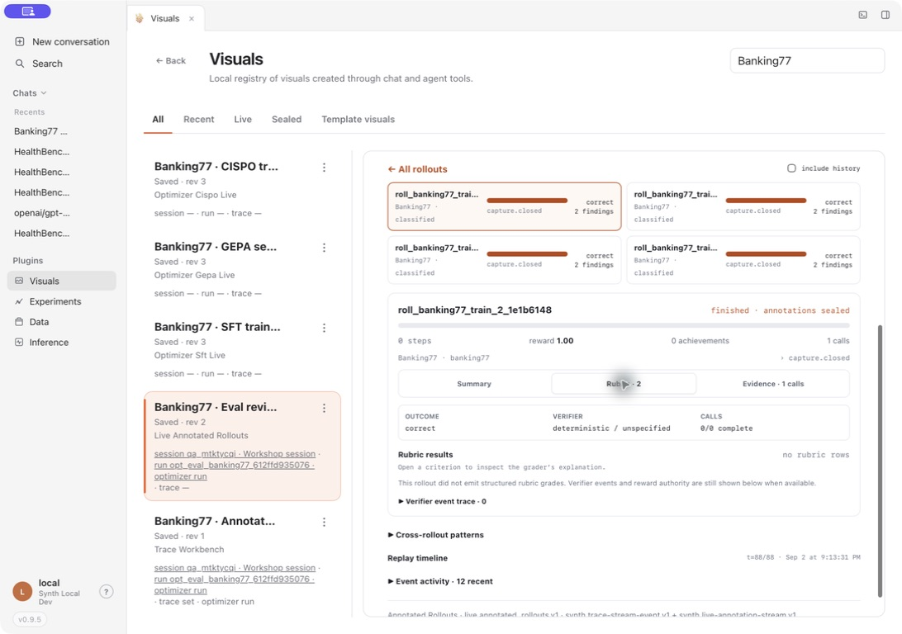

### SFT training preview

The overview combines run status, stage navigation, training curves, and checkpoints.

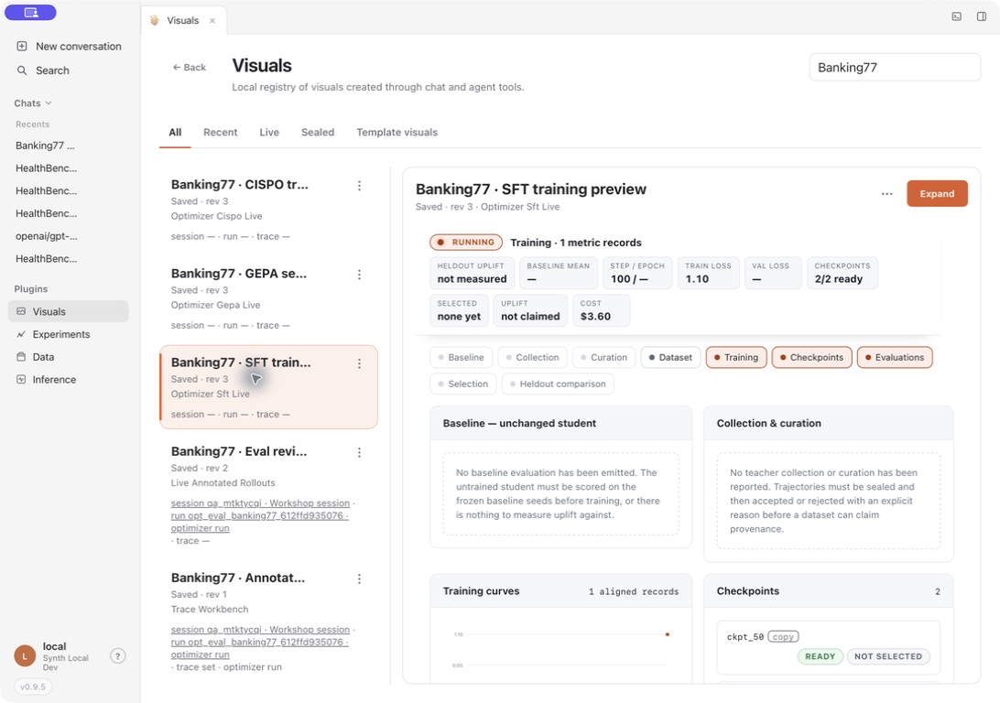

The lower state exposes selection and heldout evaluation summaries plus dataset provenance.

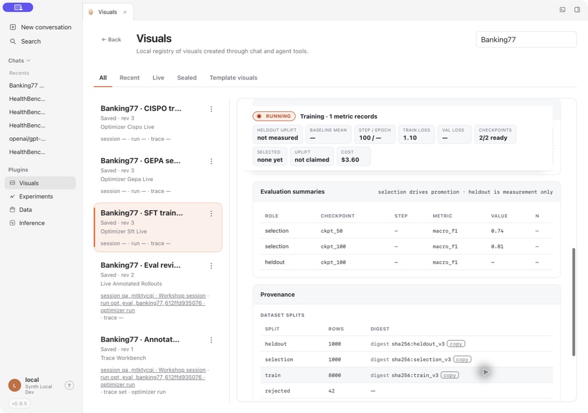

### GEPA search preview

The overview places run metrics above setup, outcome, and candidate summary.

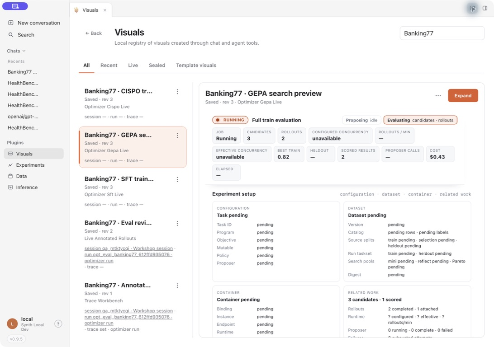

Candidate exploration expands stage navigation, the hill climb, frontier, filters, and the inspector.

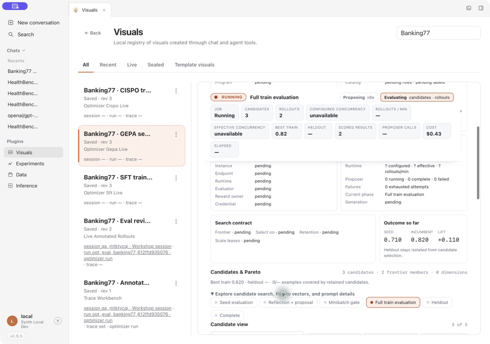

The frontier state makes both the zero-dimension empty-state problem and the oversized sticky header visible.

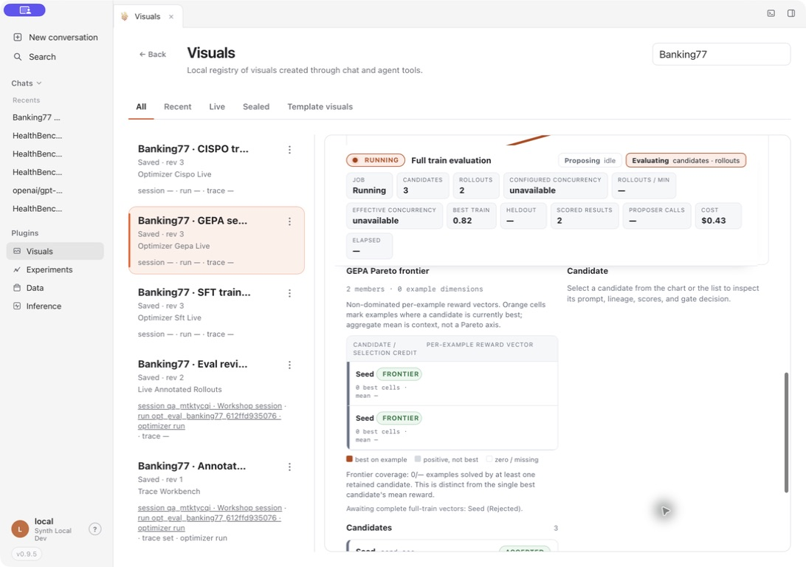

### CISPO training preview

The overview correctly foregrounds CISPO-specific clip, group, variance, advantage, and warm-start identity.

The scrolled state shows the sticky metric block covering much of the evidence canvas and the generic SFT-shaped evaluation hierarchy beneath it.

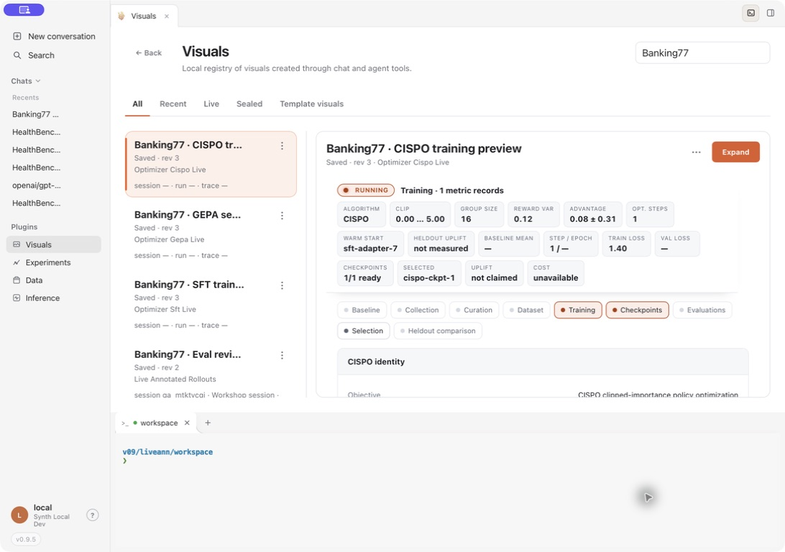

## What already works

- The registry and preview now use the available window width; the large stranded column of whitespace is gone.
- All four suite members are saved together and discoverable with the `Banking77` search.
- The eval begins with outcome and rollout lanes, then reveals summary, rubric, and evidence on demand.
- SFT makes the selection/heldout distinction explicit and gives dataset split provenance a dedicated section.
- GEPA exposes setup, outcome, candidates, frontier, and deeper evidence in a sensible conceptual order.
- CISPO foregrounds its distinguishing clip, group, variance, advantage, and warm-start values.

## Prioritized visual and interaction issues

### P1 — fix before presenting the suite as polished

1. **The sticky optimizer header obscures the content being inspected.**

   On GEPA and CISPO, scrolling leaves the large two-row metric block pinned over the canvas. Headings, charts, and cards pass behind it; the GEPA capture even shows a clipped chart stroke above the header. Keep only a compact one-line identity/status bar sticky, or collapse the metrics after the user scrolls. Relevant implementation: `visuals/chrome/tokens.css` (`.sv-workspace-header`) and `WorkspaceChrome.tsx`.

2. **The right-panel layout is too eager to collapse into a stacked page.**

   At normal zoom in a roughly 1092-point Workshop window, the list and preview stack instead of preserving the requested right-hand preview. The current layout becomes reliable only after reducing zoom. Prefer a narrower resizable list and keep the split layout until the preview itself would fall below its true minimum usable width. Relevant implementation: `apps/synth_desktop/src/renderer/src/styles/app.css`, especially the Visuals container queries near the `.visuals-layout` rules.

3. **The eval's tab count promises rubric rows that do not exist.**

   The selected rollout shows `Rubric · 2`, but the opened panel says `no rubric rows`; those two items are annotation findings, not structured rubric grades. Rename the tab to `Verifier · 2 findings`, show `Rubric unavailable`, or derive the badge strictly from structured rubric rows. Relevant implementation: the annotated-rollout detail tabs and verifier/rubric projection.

4. **Library-card identity is truncated at the exact differentiating word.**

   The narrow list renders `Banking77 · CISPO tr…`, `Banking77 · GEPA se…`, and `Banking77 · SFT train…`. The family is discoverable, but scanning is slower than it should be and other Banking77 entries become indistinguishable. Put the short display name first (`CISPO training`, `GEPA search`, `SFT training`, `Eval review`) and move `Banking77` into a muted task badge. Relevant implementation: `VisualsPage.tsx` and the card rules in `app.css`.

5. **Preview provenance looks broken rather than intentionally synthetic.**

   SFT, GEPA, and CISPO cards show `session — · run — · trace —`. That reads as missing data. Replace the empty ops line with a visible `Bundled preview` badge plus a short source label, and reserve dashes for fields that are meaningful on that surface. This is both clearer and more honest.

### P2 — improve hierarchy and legibility

6. **Optimizer metrics are flat and over-dense.**

   SFT has roughly ten tiny chips; CISPO has roughly fifteen. Because every chip has equal weight, the eye cannot quickly find status, best result, or the next decision. Group them into three tiers: outcome, progress, diagnostics. Keep two to four primary values visible and place the remainder behind `Run details`.

7. **GEPA gives missing setup data more area than its actual result.**

   Four large setup cards are dominated by repeated `pending` values, while the useful seed/incumbent/lift result is a small card below them. Collapse incomplete setup into a single `Setup incomplete` row and foreground the candidate search outcome and current activity.

8. **GEPA's empty Pareto dimensions produce a misleading matrix.**

   With zero example dimensions, the view still renders two nearly identical `Seed` frontier rows, an empty vector area, a legend, and coverage copy. Use a compact empty state until vectors exist. Candidate labels should use stable short IDs when display labels collide.

9. **SFT and CISPO repeat long absence warnings.**

   Baseline, collection, evaluation, and heldout sections each contain paragraph-length negative states. The repetition pushes real evidence below the fold. Summarize missing prerequisites once in a `What is still needed` checklist, then keep individual sections compact.

10. **A one-point training curve looks like a broken chart.**

    Both optimizer previews can show one aligned metric record. A nearly empty plot with a single dot gives little information and consumes a full card. For fewer than two points, render an explicit `1 metric sample` stat with its step/value; switch to the chart only when a trend exists.

11. **CISPO still feels like SFT with an identity card attached.**

    The CISPO identity block is good, but most of the remaining canvas uses the same baseline/collection/dataset/checkpoint sequence as SFT. Promote rollout groups, learning-signal health, clipping behavior, and advantage distribution ahead of generic training sections so the family has a distinct visual grammar.

12. **The card provenance line is noisy in narrow mode.**

    Real eval cards wrap session, run, and trace provenance across several underlined lines. Keep one short source line in the list and move full identifiers into the selected preview header or a provenance disclosure.

## Suggested information architecture

Use the same four-level hierarchy across all optimizer visuals:

1. **Outcome:** one sentence and two to four primary metrics.
2. **Current work:** stage, progress, active candidate/checkpoint, and operator actions.
3. **Decision evidence:** candidates, evaluations, heldout comparison, or verifier result.
4. **Provenance and debug:** datasets, digests, raw events, execution bindings, and exhaustive metrics behind disclosures.

This preserves the depth already present while making the first screen answer three questions immediately: *What is happening? Is it working? What should I inspect next?*

## Recommended implementation order

1. Reduce the sticky header and repair the responsive split threshold.
2. Fix eval rubric/findings labeling and preview provenance badges.
3. Reorder GEPA around outcome/current activity and add its zero-dimension empty state.
4. Consolidate SFT/CISPO absence warnings and specialize the CISPO body.
5. Shorten library-card identity and provenance lines.

## Resolution — 2026-09-02

All twelve issues are addressed in the working tree. The fixes were made at the
shared layer wherever more than one surface showed the same defect, so the
templates that were not part of this review inherit them.

### Shared primitives introduced

| Primitive | Where | Replaces |
|---|---|---|
| `WorkspaceMetric.tier` + `Run details` disclosure | `optimizer.run.v1/components/workspace/WorkspaceChrome.tsx` | Every template's flat, equally weighted chip wall (issues 1, 6) |
| Sticky identity line, scrolling metric block | `visuals/chrome/tokens.css` (`.sv-workspace-identity`) | A two-row pinned header covering its own canvas (issue 1) |
| `NotEnoughData` | `WorkspaceChrome.tsx` | Chart furniture drawn from too few points (issues 8, 10) |
| `sftMissingPrerequisites` + `What is still needed` | `overlays/sft/model.ts`, `SftWorkspace.tsx` | Four paragraph-length absence states (issue 9) |
| `candidateLabels` | `overlays/gepa/model.ts` | Two indistinguishable `Seed` rows (issue 8) |
| `visualCardIdentity`, `visualEvidenceMode` | `renderer/src/runtime/templatePresentation.ts` | Truncated suite titles and `session — · run — · trace —` (issues 4, 5, 12) |

### Issue-by-issue

| # | Fix |
|---:|---|
| 1 | Only `.sv-workspace-identity` is sticky; the metric block scrolls with the canvas and holds two to four primary values. |
| 2 | List minimum 280→240px, preview minimum 520→420px, stack threshold 870→700px, resize handle bounds matched. |
| 3 | `rubricTabLabel` reads structured grades: `Rubric · 1/2` when grades exist, `Verifier · 2 findings` when they do not. The panel says `Rubric unavailable`. |
| 4 | Cards render `CISPO training` with a muted `Banking77` badge; the full title stays in the preview header and the row's `title`. |
| 5 | Declared fixture visuals show a `Bundled preview` badge and name the template's examples; ordinary unbound visuals say `Not bound` instead of being mislabeled as sample data. |
| 6 | SFT and CISPO each keep four primary metrics; the other six and eleven fold into `Run details`. |
| 7 | Outcome and search contract render above the setup grid; a card whose every field is unreported collapses to one row, and the section head counts pending fields. |
| 8 | Zero example dimensions render a compact empty state instead of a matrix, legend, and coverage sentence; colliding candidate names take a short-id suffix. |
| 9 | Prerequisites are listed once with their reason; each panel keeps a single short line. |
| 10 | Fewer than two aligned records renders the sample's step and values instead of a one-dot plot. |
| 11 | CISPO leads with identity + learning signal, then rollout groups; the shared SFT sequence follows. |
| 12 | List cards show the most specific binding on one clamped line; full identifiers stay in the preview disclosure. |

### Gates

- `npm run test:visuals` — 304 pass (11 new in `visuals/tests/workspace_presentation.test.mjs`).
- `npm run test:a11y` — 629 pass, 13 pre-existing failures unrelated to this work
  (identical set to `d4fe88f6` minus the stale splitter-threshold assertion,
  which this change makes correct again).
- `npm run typecheck` and the packaged renderer build are clean.

## After-state visual proof — 2026-09-03

The suite was rebuilt into the `liveann` Workshop instance and inspected at
normal zoom in the list-and-preview layout. The successful captures below are
the acceptance evidence for the hierarchy changes.

### Right-panel handoff

The retained, completed Banking77 eval is left open beside its source task in
Workshop's right panel. This is the intended handoff state: the conversation
keeps the run narrative visible while the result remains independently
scrollable.

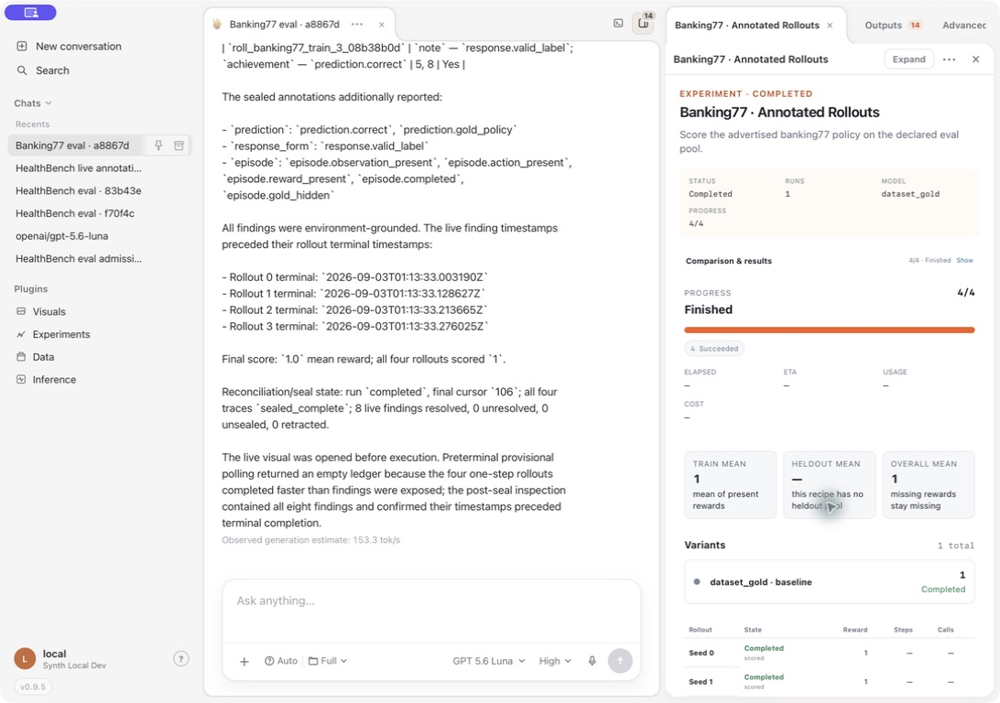

### Eval

The retained experiment overview is the durable eval result: 4/4 completed,
mean reward 1.0, no heldout pool, and no invented cost or usage values.

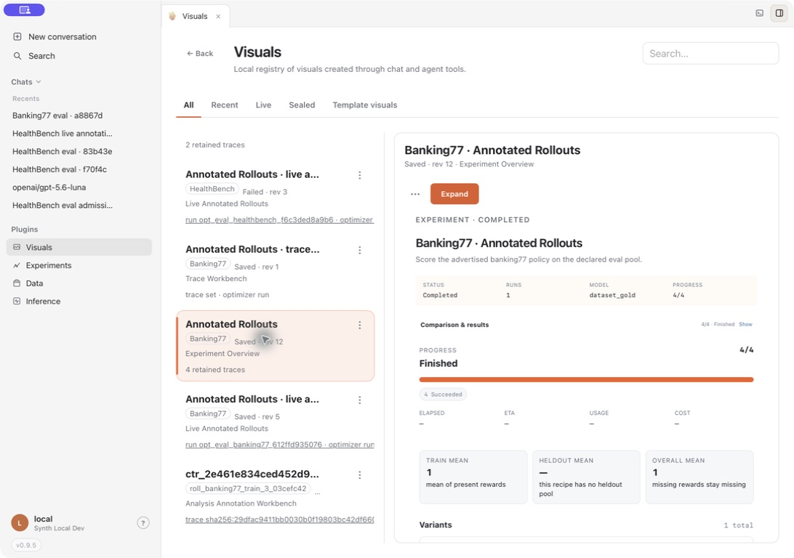

### GEPA

The outcome now leads, only four primary metrics remain visible, and wholly
unreported configuration, dataset, and container cards collapse to one honest
line each. The run's actual candidate/score summary remains expanded.

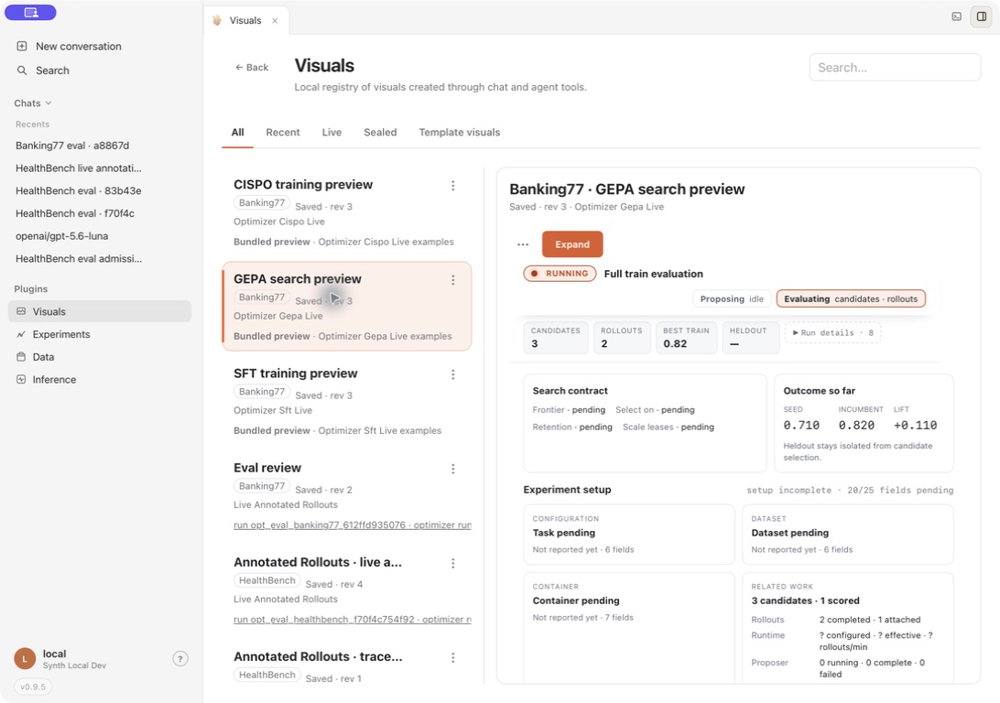

### SFT

The first screen now states the three missing proof prerequisites once. The
single training sample is treated as a stat rather than as a trend, and the
remaining metrics live behind `Run details`.

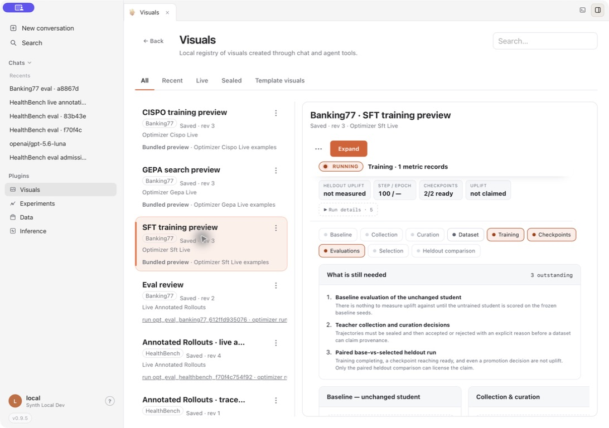

### CISPO

CISPO now has its own visual grammar: clip/group/advantage metrics, identity,
and learning-signal health lead the page. The learning-signal verdict wraps at
the narrow preview breakpoint rather than clipping.

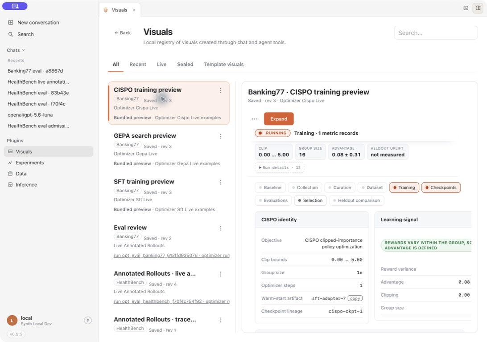

## Residual issues discovered during visual QA

These are not unresolved versions of the twelve aesthetic issues above, but
they are worth keeping in the same review because the screenshot pass exposed
them.

1. **A forked live-annotation visual is not durable after its source container
   exits.** `vis_164d19f2dd474b248d3cdf50bef2321a` retains live SSE URLs on
   `127.0.0.1:18120` but no captured event payload. After restarting Workshop
   with that container stopped, it shows `connecting` / `Waiting for the first
   rollout` even though the optimizer run is complete and its experiment
   overview is durable. The diagnostic capture is below. The product fix is to
   bind a sealed/captured replay source at completion, not to imply the eval is
   running again.

   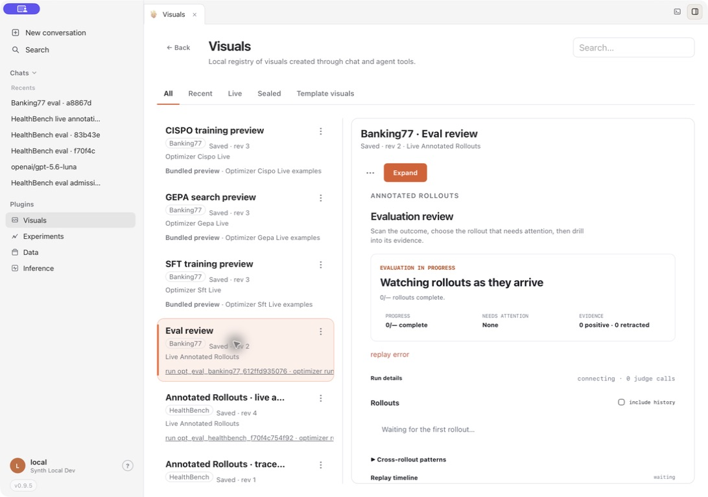

2. **The local CUA packaging wrapper still expects an assembled optional
   browser runtime.** The native `.app` and renderer build successfully, but
   `finalize-browser-app.sh` stops with `assembled browser runtime is missing`.
   This QA session used the supported Vite-backed CUA shell and an ad-hoc
   signature, without Keychain access.

3. **The app CSS debt baseline predates the current `main` stylesheet.** The
   touched rules add no new literal debt, but `lint:app-css` still reports the
   committed stylesheet above its recorded baseline (font-size 537 vs 520;
   radius 340 vs 299). This needs a separate baseline reconciliation or token
   cleanup; silently raising the baseline is not part of this visual fix.

### Reverification

- 90 focused presentation, live-annotation, GEPA, and SFT tests pass.
- `npm run typecheck` passes.
- `npm run frontend:build` passes.
- All four accepted views were inspected in the running Workshop app at normal
  zoom; the completed eval remains open in the right panel.
