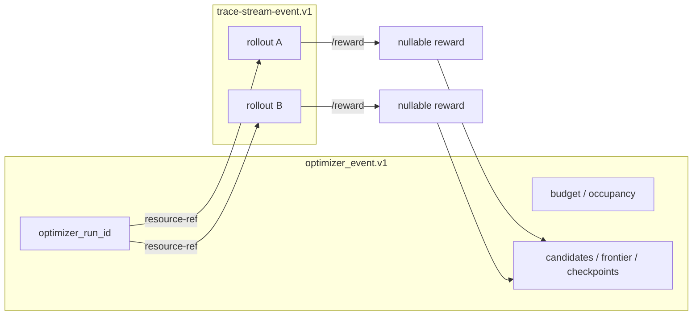

# v0.2 systems — Containers, Optimizers, Workshop

**Date:** 2026-08-12  
**What this is:** the dynamics of the floor that landed today, not a file list and not an A1–A8 pass.  
**Companion:** [`aug_12_update.md`](./aug_12_update.md) (acceptance), [`aug_12_remaining.md`](./aug_12_remaining.md) (viewer/recovery drills).

The product move is: one durable eval/trace log per rollout, one optimizer log per campaign, Workshop as a consumer that must be ready before mutation and must still reopen after compute is gone.

---

## 1. Three surfaces, two logs, one clock

```text
Workshop Desktop
  VisualRegistry     bind declared stream.id  (slot = stream, never live/jobs)
  live_spool         persist-raw before renderer publish
  EvalDriver         prepare → subscribe → start
  OptimizerManager   sidecar lifecycle  (Laguna-shaped; does not own the log)
  OptimizerService   durable optimizer mirror + cursor
        │
        ├─ synth.trace-stream-event.v1     env steps, policy spans, frames, /reward
        └─ optimizer_event.v1              search / training / checkpoints / links
                    │
                    ▼
         Containers façade                 Optimizers sidecar / hosted
         pins, leases, journal, /reward    algorithm run, child rollout refs
```

Containers owns **environment + policy + world + the eval log**.  
Optimizers owns **the campaign** and points at child rollouts; it does not ingest Craftax frames.  
Workshop owns **bind, persist, project, reopen**. It does not invent stream URLs or fill missing numbers.

Harbor is the only first-class *fold*. Craftax, Banking77, and dig.bench are *content* that execute through the same façade.

---

## 2. The clock (every authoritative run)

This order is the system. Skipping a step is a closed failure, not a retry.

```mermaid
sequenceDiagram
    participant W as Workshop visual
    participant D as EvalDriver / OptimizerService
    participant C as Containers façade
    participant L as RolloutEventLog
    participant E as Environment
    participant P as Policy (harness+config)

    W->>W: open template (craftax / harbor / digbench / gepa / sft)
    D->>C: POST /rollouts/prepare  (rollout_id, telemetry named)
    C-->>D: stream descriptor (id, poll/sse/ws URLs, cursor=sequence, reward.url, retention)
    D->>C: GET declared poll URL
    C-->>D: stream.subscribed (control, sequence=null, ready=true)
    Note over W,C: HTTP 200 is not ready. Heartbeats do not count.
    D->>C: POST /rollouts  (pins: environment_ref, policy_ref, task_world)
    loop episode
        E->>L: fsync observation / frame / env reward
        P->>L: fsync span.open / data / close
        L-->>W: poll page or SSE (same ordered IDs)
        W->>W: persist spool, then publish
    end
    C->>L: capture.closed + high-water
    D->>C: POST /reward  (absent stays null)
    C->>C: seal Trace V5 (digest ≡ log)
    Note over W,L: engine may die; spool + V5 remain
```

`telemetry.transport=auto` is refused on visual-attached / authoritative runs. The caller names `poll` / `sse` / `websocket`; the server **binds** a subset and echoes it. Silent degrade is a rewrite.

Reconnect is not a new rollout: poll `after=<last durable sequence>`, SSE `Last-Event-ID`, then resume. A timeout is unknown, not “did not land.”

---

## 3. Identity: pins, not bags

A rollout is a resolved pin, not `env: {}` / `policy: {}`.

```text
world_ref            which world image / fixture
environment_ref      which env service + generation   (not target_id)
policy_ref           { harness, config, code? }       (no sibling harness_ref)
task_world           world_id, revision, seed
task_instance_id     content-addressed resolution
stream               declared id + bound transports
```

Logical service IDs exist even when env, policy, and relay share a process. That is how a visual binds the env stream, Laguna binds policy, and an optimizer binds child evals without rewriting the task.

`restart_policy` advances policy generation and keeps the log. Environment restart that cannot restore returns `environment_restart_unsupported` instead of fabricating a checkpoint.

---

## 4. The façade and its children

`CompatPlatform` is pins, leases, occupancy, `/reward`, and the journal. Content families are `TargetRuntime` children. Adding a bench must not rewire the clock.

```text
CompatPlatform
  RolloutEventLog          fsync before publish; consumer cursor = sequence
  /reward                  GET absent → null; POST computes; never 0 for missing
  occupancy / leases       typed refusal when exhausted
        │
        ├─ craftax      env:craftax_fixture | env:craftax_gold
        ├─ harbor       fixture trial+verifier | env:harbor_docker (two docker run --rm)
        ├─ digbench     env:digbench_mock | env:digbench_relay
        ├─ openenv      env:echo gym wrap (not unmodified image; A7 out of cut)
        └─ banking77    one-shot classify (content)
```

World selection follows `environment_ref`. Planner/harness follows `policy_ref`. Gold Craftax never copies `nev_cursor` onto the consumer cursor; the relay materializes a sequence log. Workshop never speaks `nev_cursor`.

### Episode dynamics (Craftax)

```text
observation → (optional PNG frame if persist_frame returns a URL)
           → policy span.open
           → span.data (thinking / tool deltas; one open call)
           → action
           → env step + RewardSignal
           → span.close
```

Fixture stays ASCII. Gold emits PNG only when bytes were actually persisted. Broken frames stay explicit failures, not placeholder art.

Harbor: agent and verifier are distinct executions. `reward.txt` is a **script node**, not an env-sum. Missing file stays null.

dig.bench: text observation, legal actions, lives/level/steps. No frames. `/reward` from env `status` (`completed` / `game_over`). Token never in the log. Agentic MCP rides the **same** eval stream as Harbor tools (policy span), not a nested optimizer log.

DEO nested: child is a real `craftax_code_policy` isolated process. Parent `/reward` is a held-out **gate**, not a copy of child env-sum.

---

## 5. Two envelopes that do not flatten

| Stream | Schema | Owns | Does not own |
| --- | --- | --- | --- |
| Eval / trace | `synth.trace-stream-event.v1` | steps, spans, frames, env rewards, `/reward` | Pareto, checkpoints, proposer search |
| Optimizer | `optimizer_event.v1` | campaign lifecycle, budget, lineage, **links** to child `rollout_id` | env frames, NEV kinds |

Child evals are `synth.resource-ref.v1`: `rollout_id` + stream id + `/reward` URL. No signed `child_eval_ref`. No second stream for MCP or checkpoint eval.

Control records (`stream.subscribed`, heartbeats) have `sequence = null` and do not advance the evidence cursor. Evidence records have monotonic `sequence` and a content digest. Duplicate IDs collapse; conflicting digests fail closed; gaps stay visible.

`/reward` is the attempt score the leaderboard/Pareto/SFT table reads. Log `RewardSignal`s may plot provisionally on Craftax; Harbor and dig.bench provisional env-sum is unsupported. Missing ≠ 0.

---

## 6. Workshop as consumer

```text
prepare descriptor
    → bind slot "stream" to declared transports.*.url
    → wait stream.subscribed
    → persist envelope to live_spool (CAS digest)
    → publish to visual
    → on drop: poll backfill from last sequence
    → after engine gone: replay spool + sealed Trace V5
```

Templates (same reducer, different kinds):

| Family | Template | Ready before |
| --- | --- | --- |
| Craftax | `live.craftax.v1` | first paid policy call |
| Harbor | `live.harbor_eval.v1` | trial start |
| dig.bench | `live.digbench.v1` | `start_session` (token starts there) |
| GEPA | `optimizer.gepa.*.v1` | first mutating search step |
| SFT | `optimizer.sft.*.v1` | training start (A6) |

Guessed `/events` is refused. Slot `live` or `jobs` is refused. A visual scoped to one campaign/rollout cannot import another lane’s usage, frames, or selection.

The renderer folds policy deltas into **one open call**, not one row per token. That is a projection of the log, not a second log.

---

## 7. Optimizer dynamics (campaign over children)



Two algorithms, same multiplex proof, different state machines:

| Algorithm | Where it should run | Child evals |
| --- | --- | --- |
| `gepa` | synth-optimizers sidecar (`algorithm_id: "gepa"`) | Banking77 classify rollouts |
| `sft` | hosted Tinker optimizer (**not** `goex.sft.v1`) | checkpoint eval campaigns |

`goex.sft.v1` / hosted GELO is a **plugin** with the same visual primitives and a different machine. A GELO Craftax `goex` run is not A3. JSONL SFT smokes are not A4/A6.

Workshop split:

- `OptimizerManager` — install, pin, health, start/stop. Stopping it must not delete mirrored events or visuals.
- `OptimizerService` — one spool per `optimizer_run_id`, cursor, ingest, projection.

What is in tree today: manager lifecycle, two concurrent `gepa` recipe workers keyed by `optimizer_run_id`, G1 `proposer.delta` producer, standalone `algorithm_id: "sft"` parent with typed `queued` (`accelerator_busy`) and checkpoint-eval `synth.resource-ref.v1` children (`optimizers-beta-sft`, mocks). What is not: two live Banking77 GEPA jobs Luna vs Sol (A3), a hosted Tinker `sft` job (A4/A6).

---

## 8. Multiplex and isolation

The container layer already has to hold two concurrent child rollouts with distinct logs and `/reward` (C7-O). Flipping which SSE client you read must not stall the other.

On top of that, the optimizer sidecar must not serialize two campaigns behind a singleton worker. Usage is keyed by `rollout_id` / `optimizer_run_id`. Occupancy exhaustion is a typed refusal, not a silent queue that corrupts the first log. Honest `queued` on a single accelerator is allowed for A4; crossed events are not.

A visual bound to campaign A never sees campaign B’s envelopes, frames, or cost.

---

## 9. What “today” actually wired vs what still has to move

```text
wired (headless / in-process)
  pins + sequence journal + stream.subscribed + no auto
  poll / SSE / WS over the same log
  TargetRuntime children for craftax / harbor / echo / digbench / banking77
  /reward fail-closed; DEO parent = gate
  Workshop: one subscribe-first bind (classify → open slot `stream` → declared poll until `stream.subscribed` → start) for Craftax, Harbor, and dig.bench
  Visual templates for craftax / harbor / digbench
  OptimizerManager + durable optimizer mirror
  Viewer folding / isolation / truth states (see remaining.md)

still a live job (not a unit test)
  A1+A5  paid Luna med ×10 through this HTTP, visual first, reopen
  A2     in-app Harbor-packaged GameBench
  A3     two live gepa Banking77, Luna vs Sol
  A4→A6  hosted Tinker sft, then one multi-checkpoint campaign
  A8     public dig.bench, both harnesses, visual first
```

A7 (unmodified Echo image) is out of this picture. The in-process Echo wrap is a compatibility target, not a fold.

---

## 10. Failure dynamics (the ones this floor is built for)

| Pressure | Required motion |
| --- | --- |
| SSE drop mid-span | poll from last sequence; collapse exact replay; resume live |
| Container gone | reopen from spool + Trace V5; no guessed ASCII frames |
| Prepare/start retry | same `rollout_id` → replayed; conflicting body → 409 |
| Missing reward/usage/sequence | stay null / fail closed; never coerce to 0 |
| Policy restart | new policy generation; log retained |
| Env restart without checkpoint | typed unsupported; no fake restore |
| Sidecar stop | mirror and visuals remain |
| Auth rotation | stream identity unchanged; token never in log or screenshot |

Those motions are implemented in-process. The remaining tickets are the live proofs that they hold under paid calls, killed sockets, and a fresh Workshop workspace.

---

## 11. Before → after (what remains)

Left is the system as it actually runs today. Right is the same topology after the remaining motions close. The boxes already exist; the **edges that still do not carry a live job** are the remainder.

### 11.1 Primary loop — paid eval through Workshop

```text
BEFORE (today)                                      AFTER (A1 + A5)

  Workshop                 gold CLI                   Workshop                 Containers HTTP
 ┌──────────────┐         ┌──────────┐               ┌──────────────┐         ┌──────────────┐
 │ visual       │         │ Luna med │               │ live.craftax │ bind    │ prepare      │
 │ templates    │         │ 10× gold │               │ visual READY │────────►│ descriptor   │
 │ eval_driver  │         │ HTTP     │               │ spool        │ poll    │ stream.id    │
 │ live_spool   │         └────┬─────┘               └──────┬───────┘         └──────┬───────┘
 └──────┬───────┘              │                            │  stream.subscribed     │
        │                      │                            │◄───────────────────────┤
        │   not this job       │                            │                        │
        │   guessed /events    ▼                            │  POST /rollouts        ▼
        │                 ┌──────────┐                      ├───────────────────────►┌──────────┐
        │                 │ NEV log  │                      │   paid Luna 10×        │ sequence │
        │                 │ Trace V5 │                      │                        │ journal  │
        │                 └──────────┘                      │                        │ /reward  │
        │                                                   │                        │ Trace V5 │
        │  façade exists,                                   │  engine dies           └────┬─────┘
        │  headless C3 only                                 │◄── reopen spool+V5 ─────────┘
        ▼                                                   ▼
   connect-after-run                                   visual-first, declared URLs
```

Remainder: the **paid** edge from a ready visual onto the façade, then reopen after the container is gone.

### 11.2 Optimizer as parent of child rollouts

```text
BEFORE (today)                                      AFTER (A3, A4→A6, proposer.delta)

  GELO goex / JSONL smoke                           campaign ──links──► children
 ┌─────────────────────┐                           ┌──────────────────┐
 │ goex.sft.v1 / GELO  │                           │ optimizer_event  │
 │ one run, own JSONL  │                           │  run A  Luna     │──┐
 │ proposer.delta      │                           │  run B  Sol      │──┤
 │   consumer only     │                           │  multiplex       │  │
 └──────────┬──────────┘                           │  delta PRODUCER  │  │
            │ flatten or                            └────────┬─────────┘  │
            │ no child refs                                  │ resource-ref
            ▼                                                ▼            ▼
     ┌────────────┐                                  ┌────────────┐ ┌────────────┐
     │ Craftax    │                                  │ Banking77  │ │ Banking77  │
     │ frames on  │                                  │ rollout A  │ │ rollout B  │
     │ optimizer  │                                  │ /reward    │ │ /reward    │
     │ stream     │                                  └─────┬──────┘ └─────┬──────┘
     └────────────┘                                        │              │
  Manager exists, no two-run spawn                    flip visual A↔B     │
  Tinker sft = stubs                                  usage never crosses─┘
                                                      SFT: Tinker job → ckpt
                                                           → eval campaign
                                                           → same child shape
```

Remainder: two live Banking77 `gepa` jobs (A3) and hosted Tinker `sft` jobs (A4 then A6). Core spawn, `proposer.delta` producer, and SFT parent/queued/resource-refs are in tree. GELO/JSONL stay off this diagram.

### 11.3 Content on one Desktop bind

```text
BEFORE (today)                                      AFTER (A2 + A8)

  Desktop                         façade            Desktop                    façade
 ┌────────────┐                  ┌────────┐        ┌────────────┐             ┌────────┐
 │ Craftax    │──templates only──│ C3 HTTP│        │ Craftax    │──A1 paid───►│        │
 │ Harbor     │  fixture/ATIF    │ C4/C5  │        │ Harbor     │──register──►│  one   │
 │            │  not in-app      │ docker │        │  .harbor_  │  v1 first   │  clock │
 │ dig.bench  │  mock/relay      │ C8     │        │  eval.v1   │             │  one   │
 │            │  not public game │        │        │ dig.bench  │──both──────►│  log   │
 └────────────┘                  └────────┘        │  .v1 first │  harnesses  │  /rew  │
                                                   └────────────┘  no frames  └────────┘
  Echo wrap = in-process, A7 out                   reopen after Harbor trial /
                                                   dig.bench session gone
```

Remainder: Harbor-packaged GameBench **started in-app** (A2) and public dig.bench **with a real token** (A8). Desktop already classifies, writes `metadata.liveEval`, opens the family template on slot `stream`, and waits for `stream.subscribed` before start. Not new façades.

### 11.4 Failure motion — in-process vs live

```text
BEFORE (today)                                      AFTER (A11, A12, O1–O4)

  producer ──fsync──► journal ──► tests             producer ──fsync──► journal
                           │                                              │
                           │  unit: cursor, 409,                          │  live:
                           │  digest, isolation                           │
                           ▼                                              ▼
                    green suite                                  SSE drop mid-span
                                                                 poll after=N
                                                                 collapse replay
                                                                 resume same call

                                                                 kill container
                                                                 reopen spool+V5
                                                                 no fake ASCII

                                                                 retry prepare/start
                                                                 one paid execution
                                                                 conflict → 409

                                                                 budget / cancel /
                                                                 auth rotation
                                                                 stream id unchanged
```

Remainder: the same journal under a killed socket, a dead container, and a second paid-call counter.

### 11.5 Whole map

```text
BEFORE                                              AFTER

 Workshop ─x─ paid Craftax HTTP                     Workshop ──paid──► Craftax HTTP ──V5──► reopen
      │                                                  │
      ├─x─ Harbor in-app                            ├──── Harbor register ──► same clock
      ├─x─ dig.bench public                         ├──── dig.bench public ──► same clock
      │                                                  │
      └─ OptimizerManager                           └─ two gepa ──links──► child /reward
           │  GELO / stubs                                 │  delta produced
           └─ no child parent                              └─ Tinker sft ──► ckpt evals

  agent guesses URLs                                agent: discover → visual first → stop on fail
```

### 11.6 Core code vs live proof

The AFTER diagrams are the target. **Core code** closes the edges that can be closed without a paid provider call. **Live proof** is the remaining ticket once that code exists.

| AFTER edge | Core code (this cut) | Still a live job |
| --- | --- | --- |
| Visual-first Craftax HTTP | One bind clock: register → visual on slot `stream` → declared poll until `stream.subscribed` → start; 10-lane pins seeds 0–9 without a paid call; spool reopen | Paid Luna med ×10 (A1+A5) |
| Harbor in-app | Same clock; `live.harbor_eval.v1` before trial start; pins `luna_med` + `sol_med`; `live_frames=native` fails register | Docker packaged GameBench trial (A2) |
| dig.bench Desktop | Same clock; `live.digbench.v1` before `start_session`; basic ReAct + agentic Codex+MCP pins; no frames; token refused in log | Public game + token (A8) |
| Two GEPA parent | Manager-spawned two `algorithm_id: "gepa"` workers + distinct spools; child `resource-ref`; G1 `proposer.delta` producer | Banking77 Luna vs Sol paid (A3) |
| Tinker SFT parent | `algorithm_id: "sft"` in `optimizers-beta-sft`: one-accelerator `queued` (`accelerator_busy`), distinct logs, checkpoint evals as `synth.resource-ref.v1`; OpenAI FT refused (mocks, no live Tinker) | Hosted Tinker jobs (A4 then A6) |
| Failure motion | Cursor/409/digest already in-process | Kill SSE/container; paid exactly-once |
| Agent operator | Skills refuse guessed `/events`; visual first; Harbor/dig.bench pins named; stop on tool fail | Fresh-workspace Sol run (W1–W3) |

Do not claim the right-hand column from the left-hand column.

